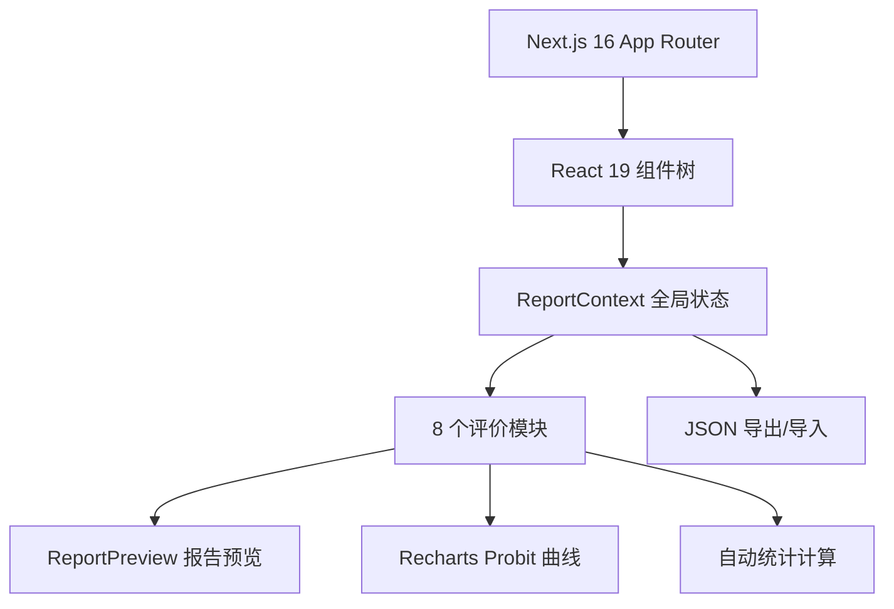

## 项目介绍

[Vali15189](https://github.com/SchemaBio/Vali15189) 是一个面向分子诊断实验室的 **NGS 分析方法学性能评价报告生成工具**，依据 **ISO 15189:2022 / CAP / CNAS-GL039** 标准，帮助实验室快速生成符合认证要求的性能确认/验证报告。

在临床 NGS 实验室认证过程中，方法学性能评价（Method Validation/Verification）是核心环节。实验室需要逐项评估检测系统的符合率、精密度、检出限、分析特异性等指标，并编制标准化报告。传统方式依赖 Excel 手工统计 + Word 模板填写，流程繁琐、易出错、格式不统一。

Vali15189 将这一流程 Web 化、自动化：数据录入即统计、报告实时预览、一键打印/导出 PDF。

---

## 核心功能

### 1. 8 大评价模块，完整覆盖 ISO 15189 方法学验证要求

| 模块 | 内容 | 核心统计指标 |
|------|------|-------------|
| **检测系统概述** | 测序仪、试剂盒、生信流程、标本类型 | 报告元数据、适用标准 |
| **实验质控** | 文库制备 QC 指标 | 可配置阈值、自动通过/不通过判定 |
| **数据质控** | 测序数据 QC 指标 | 比对率、覆盖度、均一性、污染率 |
| **符合率评价** | 参考方法 vs 检测方法比对 | TPR/TNR/PPV/NPV 自动计算，支持分组统计 |
| **精密度评价** | 5 天 × 3 重复实验方案 | 批内 CV、批间 CV、总 CV、检出率 |
| **检出限评价** | 梯度稀释法 + Probit 分析 | LOD95 线性插值估算、Probit 曲线可视化 |
| **分析特异性** | 交叉反应 + 干扰实验 | 分类统计、通过/不通过判定 |
| **可报告范围** | 变异类型覆盖、检测限、局限性 | 报告范围汇总 |

### 2. Excel 粘贴支持：数据录入零摩擦

所有数据表格均支持从 Excel 复制 TSV 数据后 **Ctrl+V 一键填入**。每个模块还提供**下载模板**功能，用户可先在线下 Excel 中整理数据，再粘贴至系统。

```tsv
# 符合率数据粘贴示例（列顺序：样本编号、样本类型、位点类型、位点、丰度、参考结果、检测结果、备注）
S001	参考品	SNV	EGFR L858R	5%	阳性	阳性
S002	参考品	SNV	EGFR T790M	3%	阳性	阴性
```

### 3. 实时统计与可视化

- **符合率模块**：自动计算灵敏度（TPR）、特异度（TNR）、阳性预测值（PPV）、阴性预测值（NPV）、准确度，可按样本类型/位点类型分组统计
- **精密度模块**：自动分组计算批内（重复性）与批间（再现性）CV，超标值红色标注
- **检出限模块**：基于 Probit 数据绘制检出率曲线，线性插值估算 LOD95，95% 参考线醒目标示

### 4. 报告预览与打印

点击"预览报告"可查看完整的标准化报告，包含：
- 报告封面（实验室信息、报告编号、日期）
- 各评价模块的格式化表格
- 验证结论与建议
- 编制/审核/批准人签署栏

支持**浏览器打印/导出 PDF**，打印样式自动适配 A4 纸张。

### 5. JSON 导入/导出：数据持久化与协作

- **导出 JSON**：将全部报告数据序列化为 JSON 文件下载
- **导入 JSON**：从 JSON 文件恢复报告数据，支持跨设备协作
- **示例数据**：提供 `sample-data.json` 可直接导入体验完整功能

### 6. 进度追踪与导航

- 每个模块有 **pending → in-progress → completed** 三态标记
- 侧边栏实时显示完成进度百分比
- "下一步"按钮自动标记当前模块为完成并跳转
- 侧边栏支持**折叠模式**（仅图标），节省屏幕空间

### 7. 可配置 QC 阈值

实验质控和数据质控模块支持自定义指标阈值：
- **数值型**：大于等于、小于等于、等于、不等于
- **布尔型**：通过/不通过文本匹配
- **文本型**：等于、包含、不包含

每个指标可独立开关，阈值可自由调整，适配不同实验室的 SOP 要求。

---

## 技术架构



### 技术栈

| 层级 | 技术选型 |
|------|---------|
| **框架** | Next.js 16 (App Router) |
| **UI** | React 19 + TypeScript 5.7 |
| **组件库** | shadcn/ui (Radix UI + Tailwind CSS 4) |
| **图表** | Recharts 2.15 |
| **状态管理** | React Context (ReportContext + PreviewContext) |
| **通知** | sonner (Toast) |
| **图标** | lucide-react |

### 设计决策

- **纯前端应用**：无外部数据库依赖，无需后端服务，部署即用
- **React Context 状态管理**：避免引入 Redux/Zustand 等重型方案，Context 足够覆盖单报告编辑场景
- **JSON 文件持久化**：数据通过 JSON 文件导出/导入实现持久化，简单可靠，符合实验室数据管理习惯
- **打印优先的报告预览**：报告预览直接复用 `@media print` 样式，无需额外的 PDF 生成库

---

## 快速开始

```bash
git clone https://github.com/SchemaBio/Vali15189.git
cd Vali15189
pnpm install
pnpm dev        # 开发模式 → http://localhost:3000
pnpm build      # 生产构建
```

### 体验示例数据

启动后，点击侧边栏"导入 JSON"，选择 `public/sample-data.json` 即可加载完整的示例报告数据。

---

## 适用场景

- **临床分子诊断实验室**通过 ISO 15189 / CAP / CNAS 认证
- **NGS 试剂盒厂商**进行产品性能验证
- **第三方医学检验所**新建检测项目的方法学确认
- **医院病理科/检验科**进行方法转移验证

---

## 许可

MIT License
