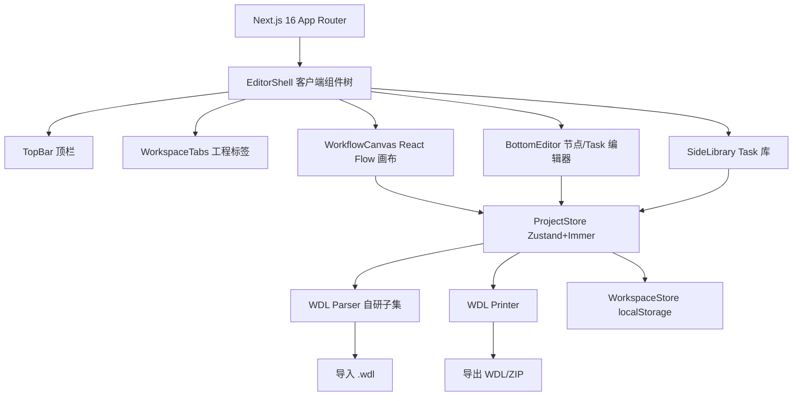

## 项目介绍

[ShowMeWDL](https://github.com/pzweuj/ShowMeWDL) 是一个类 ComfyUI 的 **WDL（Workflow Description Language）可视化工作流编辑器**，基于 Next.js 纯前端实现，让生信工程师可以像搭积木一样拖拽 task、连线成图，再一键导出标准 WDL 脚本。

在基因组学/生信领域，WDL 已成为描述分析流水线的事实标准之一，但写 WDL 长期以来是"纯文本"工作：在编辑器里手敲 `call`、对照 `input {}` / `output {}` 块、用 `# Section01` 注释手工分节、跨多个 task 文件来回切换。流程一旦复杂，节点依赖关系、变量绑定、runtime 配置就会变得难以追踪。

ShowMeWDL 把这一过程**图文化**：左侧 Task 库按 Docker 镜像分组管理，中间画布拖拽 Call 节点、端口连线，底部面板就地编辑节点详情，顶栏一键导入/导出 WDL。所见即所得，导出即可跑。

你也可以[通过Vercel在线使用](https://wdl.biotools.space)，所有文件保存在浏览器本地，不会上传服务器。

---

## 核心功能

### 1. 四面板编辑器布局，类 ComfyUI 工作流体验

| 面板 | 位置 | 作用 |
|------|------|------|
| **顶栏 TopBar** | 顶部 | 工程命名、导入/导出、校验、语言、主题切换、GitHub 入口 |
| **Task 库 SideLibrary** | 左侧 | 按 Docker 镜像分组的 task 列表，支持折叠、新增分组 |
| **工作流画布 WorkflowCanvas** | 中间 | React Flow 画布，Call 节点 + 端口连线，支持 `# SectionNN` 分节列布局 |
| **底部编辑器 BottomEditor** | 中下 | 单击节点后在此编辑 input 绑定、runtime 覆盖、task 定义、struct 等 |

双击画布空白处可打开 Workflow 元数据编辑（workflow inputs/outputs、命名）；单击节点即在底部面板展开对应编辑器。

### 2. Task 库：按 Docker 镜像分组管理

每个 task 是一个可复用单元，包含：

- **inputs / outputs**：带类型（`File`、`Array[File]`、`Map[String, Int]`、`Pair`、自定义 struct 等）与可选默认值
- **command**：支持 `~{var}` 插值的命令模板（代码编辑器高亮）
- **runtime**：`docker` / `cpu` / `memory` / `disks` / `gpu` 等运行时规格
- **meta**：自由元数据键值对

Docker 分组自动从 task 的 `runtime.docker` 派生标签（如 `schema-germline`），也可手工创建空分组后再添加 task。同一 task 可被多个 workflow 反复 `call`。

### 3. 可视化工作流画布

- **Call 节点**：从左侧拖入画布即生成，端口按 task 的 input/output 自动渲染，类型颜色编码（File 蓝、String 绿、Int 黄、Boolean 红、Array 青、Map 蓝绿、Struct 灰）
- **端口连线**：源端口 → 目标端口拖拽即建立绑定，**静态类型校验**——类型不兼容时连线被拒绝，可选类型（`?`）兼容性按 WDL 语义处理
- **Scatter / If 节点**：支持 `scatter` 与 `if` 嵌套块，子节点 `parentId` 关联父容器
- **Decl 节点**：工作流级 `decl` 表达式节点，可放表达式绑定
- **Workflow Input 节点**：画布左侧固定的 workflow 输入端口列
- **`# SectionNN` 分节布局**：导入 WDL 时识别分节注释，自动按列排布（BAM 列、CNV 列、报告列…），导出时还原注释

### 4. 导入 / 导出：双向 WDL 往返

| 方向 | 形式 | 说明 |
|------|------|------|
| **导入** | 单/多 `.wdl` 文件 | 自研子集 parser 解析 `version` / `import` / `task` / `workflow` / `call` / `scatter` / `if` / `struct`，按 Docker 镜像自动分组 |
| **导出** | 单文件 WDL | `Workflow.wdl` 一个文件包含所有 task + workflow，含分节注释 |
| **导出** | 结构化 ZIP | `tasks/<分组>.wdl` + 根目录 `Workflow.wdl`（自动 `import`），适合大项目归档 |

```wdl
# Section01 · BAM
call AlignBwamem as align {
  input:
    fastq_r1 = workflow_input.r1,
    fastq_r2 = workflow_input.r2,
    reference = workflow_input.ref
}
```

### 5. Runtime 覆盖与 task 变体

Call 节点支持 **runtime 覆盖**：同一 task 在不同 call 点可以指定不同的 docker 镜像、CPU、内存。导出时，带覆盖的 call 会被序列化为 task 变体（`isVariant` / `baseTaskId`），保证导出 WDL 的运行时语义与画布一致。

### 6. 本地工作区：多工程标签切换

工程数据通过 **localStorage** 按虚拟路径持久化，分三类目录：

```
demo/         # 内置示例（schema-germline 单 WES 全流程）
imports/      # 从 .wdl 文件导入的工程
workspace/    # 用户新建/编辑的工程
```

- 顶栏可同时打开多个工程标签，点击切换
- 自动持久化（500ms debounce），关闭浏览器不丢数据
- 支持"新建空白工程""加载 Demo""重命名当前工程"

### 7. 静态校验

顶栏"校验"按钮一键扫描：

- 端口类型不兼容的连线
- Call 缺失必要 input 绑定
- 引用了不存在的 task / struct
- Workflow 输出表达式引用了未定义的节点

问题数以红色徽章实时显示在顶栏校验按钮上。

### 8. 内置 Demo：schema-germline 单 WES 全流程

启动即加载来自 [`schema-germline/single.wdl`](https://github.com/pzweuj/schema-germline) 的完整 demo——从 FASTQ 到 BWA 比对、CNV、MEI、STR、ROH、VEP 报告的 30+ task 全流程，按 `# SectionNN` 自动分列排布。无需任何配置即可体验"打开就有图"的效果。

### 9. i18n 与主题

- **中 / 英双语**：顶栏一键切换，所有 UI 文案、Toast、节点标签均通过 `messages/zh.ts` + `messages/en.ts` 管理，`localStorage` 记忆偏好
- **深 / 浅色主题**：基于 `next-themes`，画布、节点、面板全套适配 CSS 变量

---

## 技术架构



### 技术栈

| 层级 | 技术选型 |
|------|---------|
| **框架** | Next.js 16 (App Router, Turbopack) |
| **UI** | React 19 + TypeScript 6 |
| **样式** | Tailwind CSS 4 + CSS 变量主题 |
| **画布** | @xyflow/react (React Flow) 12 |
| **状态管理** | Zustand 5 + Immer middleware |
| **代码编辑** | @uiw/react-textarea-code-editor |
| **打包/ZIP** | JSZip |
| **主题** | next-themes |
| **图标** | lucide-react |
| **测试** | Vitest |
| **核心引擎** | 自研 WDL 子集 parser / printer (TypeScript) |

### 设计决策

- **纯客户端应用**：无后端、无数据库，所有数据落在浏览器 `localStorage`，部署到 Vercel/任意静态托管即用，符合生信工程师"本地优先、可离线"的使用习惯
- **自研 WDL 子集 parser/printer**：不依赖 miniwdl / wdltool 等外部运行时，用 TypeScript 实现一个覆盖 `version` / `import` / `task` / `workflow` / `call` / `scatter` / `if` / `struct` / `decl` 的实用子集，保证 AST → 工程模型 → 画布 → WDL 的**往返一致性**
- **Zustand + Immer 而非 Redux**：项目状态结构清晰（Project → Tasks / Workflows / DockerGroups / Structs），Immer 让可变更新写起来像赋值，避免 Redux 的样板代码
- **React Flow 复用而非自造画布**：节点拖拽、端口连线、缩放平移等交互交给 React Flow，自身只实现 WDL 语义层（节点类型、端口类型校验、分节列布局）
- **类型颜色编码**：`File` 蓝、`String` 绿、`Int` 橙…通过 `typeColor()` 统一驱动端口、连线、徽章配色，让"看一眼就知道连得对不对"
- **i18n 用 `DeepString<typeof zh>` 类型**：`zh.ts` 以 `as const` 写源语言，`Messages = DeepString<typeof zh>` 在保留结构的同时把字面量类型拓宽为 `string`，让 `en.ts` 可以填入不同的英文翻译而不必逐字面量对齐

---

## 快速开始

```bash
git clone https://github.com/pzweuj/ShowMeWDL.git
cd ShowMeWDL
npm install
npm run dev      # 开发模式 → http://localhost:3000
npm run build    # 生产构建
npm test         # Vitest 单测
```

### 体验示例数据

启动后默认加载内置的 `Demo`（schema-germline 单 WES 全流程）。也可以：

1. 顶栏点击 **导入 WDL**，选择本地 `.wdl` 文件
2. 顶栏点击 **新建**，从空白工程开始
3. 左侧 Task 库 → 拖拽 task 到画布
4. 节点端口拖拽连线
5. **导出 WDL** 下载单文件，或 **导出 ZIP** 下载结构化工程

---

## 适用场景

- **生信工程师**快速搭建 / 重构 WDL 流水线原型，避免手敲易错
- **生物信息流程维护者**对已有 WDL 工程做可视化梳理，按 Docker 镜像分组重组织
- **生信教学**直观展示 task / workflow / scatter / if 的协作关系
- **WDL 初学者**结合 Demo 与画布理解 `call`、`input`/`output` 端口绑定、runtime 配置
- **跨团队协作**：导出结构化 ZIP 后归档版本，或导入他人 `.wdl` 直接生成可编辑画布

---

## 许可

MIT License
