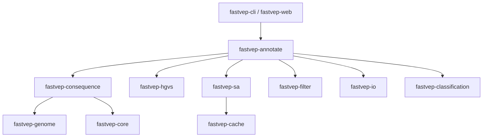

## 项目介绍

生信软件的世界里，有一大批"老家伙"——Ensembl VEP、GATK、samtools 这些，很多是用 Perl、R、Java 写的，诞生于二十年前，至今仍是分析管线的中坚。它们的正确性毋庸置疑，但性能、部署、可维护性都停留在上一个时代：动辄几百 MB 的内存、几十上百 MB 的安装包、一堆 CPAN/CRAN 依赖，一跑就是几小时。

在编程 Agent 猛烈发展的今天，我看好会迎来一波巨大的重构潮——用 Rust、Go 这类现代语言把老工具重写一遍，用更少的依赖、更快的速度、更稳的并发把同样的活干完。fastVEP 就是这波浪潮里很有代表性的一员。

[fastVEP](https://github.com/Huang-lab/fastVEP) 是一个用 **Rust** 编写的变异效应预测器（Variant Effect Predictor），用于预测基因组变异（SNP、插入、缺失、结构变异）在基因、转录本和蛋白质序列上的功能后果。它受 Ensembl VEP 和 Illumina Nirvana 启发，目标是与它们保持兼容，同时借助 Rust 的零成本抽象与原生并行，带来量级的性能提升。

干了这么多年生信，VEP 的"慢"是刻在骨子里的——一个全基因组样本跑注释，单线程动辄一个多小时，内存飙到几百 MB，还依赖 Perl 5.22+ 和一堆 CPAN 模块。fastVEP 把这条路彻底换了个引擎：同样一份人类 WGS，单线程 197 秒跑完，多线程 10 核只要 93 秒，内存峰值只有 2.8 MB，二进制 3.3 MB，零外部依赖。

官方已经跑了一个在线服务 [fastVEP.org](https://fastvep.org)，累计服务了 2300+ 次基因组分析会话、注释了约 19000 个变异。

---

## 核心功能

### 1. 变异后果预测

使用 **49 个 Sequence Ontology 术语**对变异进行分类，覆盖 missense、frameshift、splice donor 等常见后果，与 VEP 的 consequence 体系保持一致。

### 2. 结构变异支持

完整的 SV 支持管线，处理 **DEL、DUP、INV、CNV、BND、INS、STR** 七类结构变异，并给出 SV 专属的后果分类。

### 3. 补充注释（Supplementary Annotation）

通过自研的 **fastSA 格式**直接集成多个公共数据库：

| 层级 | 数据库 |
| :--: | :----: |
| 变异 | ClinVar、gnomAD、dbSNP、COSMIC、1000 Genomes、TOPMed、MitoMap |
| 预测分数 | PhyloP、GERP、REVEL、SpliceAI、PrimateAI、DANN、AlphaMissense（SIFT/PolyPhen 经 dbNSFP） |
| 基因层面 | OMIM 表型、gnomAD 基因约束（pLI、LOEUF）、ClinGen 基因-疾病关联 |

fastSA 格式有 v1 和 v2 两个版本：

- **v1**：zstd 块压缩
- **v2**（`.osa2`）：借鉴 echtvar 的分块 ZIP + Var32 编码

两者共享一套 **线程可扩展、字节预算的 LRU 缓存** 来缓存解压块，配合无锁读取。v2 压缩率更优：ClinVar 从 48.1 MB 降到 38.9 MB（0.81×），REVEL chr1 从 40.5 MB 降到 19.0 MB（0.47×），而注释输出与 v1 的 `.osa` 格式**字节级一致**（md5 验证过）。

### 4. 过滤引擎

内置表达式过滤，**兼容 VEP 的 filter_vep 语法**：

```bash
fastvep filter -i annotated.vcf \
  --filter "IMPACT is HIGH or (Consequence in missense_variant and AF < 0.001)"
```

### 5. HGVS 命名

生成 **HGVSg、HGVSc、HGVSp** 三种命名法，带 3' 端归一化。

### 6. 多种输出格式

| 格式 | 说明 |
| :--: | :--: |
| **VCF** | 以 49 字段的 `CSQ` INFO 字段输出，另含 fastVEP 专属的 `ACMG`/`ACMG_CRITERIA`；SA 源输出 `FV_*` 投影（如 `FV_CLINVAR`、`FV_GNOMAD`） |
| **Tab** | 每个变异-转录本-等位基因组合一行，共 17 列 |
| **JSON** | 结构化输出，含 `transcript_consequences` 数组与完整 SA 对象 |

### 7. 多样本支持

解析 FORMAT/GT/DP/GQ/AD 字段，按样本逐个做基因型分类。

### 8. 调控区域检测

从 Ensembl 调控构建中识别启动子、增强子、CTCF 结合位点、转录因子结合位点。

### 9. 线粒体支持

处理环状坐标，使用脊椎动物线粒体密码子表。

### 10. 自定义注释

支持用户自带的 VCF 和 BED 文件，**像 VEP 的 `--custom` 一样**挂载自定义注释，但方式不同：VEP 是即时读取原始文件，fastVEP 是先 `sa-build` 预编译成 fastSA 二进制格式，再统一通过 `--sa-dir` 加载。

| 数据源 | 参数 | 产物 | 匹配方式 |
| :--: | :--: | :--: | :--: |
| 自定义 VCF | `--source custom_vcf` | `.osa`（等位基因级） | 按 `(pos, ref, alt)` 精确匹配 |
| 自定义 BED | `--source custom_bed` | `.osi`（区间级） | 按位置重叠，返回所有包含该变异的区间 |
| 自动检测 | `--source custom` | 视输入而定 | 按扩展名自动识别 VCF/BED |

```bash
# 等位基因级 VCF：--name 指定键名，--info-fields 选保留哪些 INFO 列
fastvep sa-build --source custom_vcf --name clinical \
  --info-fields CLIN_LABEL,CLIN_SCORE \
  -i my_clinical.vcf.gz -o sa_databases/clinical

# 区间级 BED：score 和 name 列自动透传
fastvep sa-build --source custom_bed --name myregions \
  -i my_regions.bed -o sa_databases/myregions

# 加载：.osa 和 .osi 都放 --sa-dir 里，注释时自动拾取
fastvep annotate -i variants.vcf -o annotated.vcf \
  --gff3 genes.gff3 --fasta ref.fa --sa-dir sa_databases/ --hgvs
```

`--name` 控制输出标识：`--name clinical` 对应的 JSON 键是 `clinical`，VCF 的 INFO 字段 ID 是 `FV_CLINICAL`；省略则用输入文件名。省略 `--info-fields` 会保留所有 INFO 键，但生成的 JSON 对象会异构。注意自定义输入**总是用 v1 容器**（`.osa`/`.osi`），`--format osa2` 对 `custom_*` 源不可用。

### 11. ACMG-AMP 分类

完整实现 Richards 2015 + ClinGen SVI 规则集——**28 条判据**、可配置阈值、trio/复合杂合支持。

### 12. 合并注释

一次运行合并 Ensembl + RefSeq 注释，每个转录本带 `SOURCE` 标签。

### 13. 其他实用功能

- **`--sa-only` 模式**：跳过 CSQ 管线，只输出补充注释
- **gzipped VCF 输入**：自动识别 `.vcf.gz` / `.vcf.bgz`
- **内置 Web 界面**：交互式变异注释
- **GFF3 注释支持**：可从标准 GFF3 文件加载任意物种的基因模型

---

## 性能基准

苹果 M 系列上、release 构建 + LTO 的实测吞吐：

### 多物种吞吐

| 物种 | 变异数 | 耗时 | 吞吐 |
| :--: | :----: | :--: | :--: |
| 酵母（全基因组） | 260,526 | 3.0s | 85,934 v/s |
| 果蝇 | 4,438,427 | 57.3s | 77,486 v/s |
| 拟南芥 | 12,883,854 | 168.7s | 76,378 v/s |
| 小鼠（全基因组） | 26,062,054 | 338.0s | 77,113 v/s |
| 人类 WGS（GRCh38） | 4,048,342 | 86.3s | 46,917 v/s |

### 与 Ensembl VEP v115.1 头对头对比

单线程、GIAB HG002、相同 GFF3 + FASTA：

| 场景 | fastVEP | VEP v115.1 | 加速比 |
| :--: | :-----: | :--------: | :----: |
| 仅后果 | 197.8s | 4,621s | **23.4×** |
| +ClinVar | 197.4s | 4,803s | **24.3×** |
| +gnomAD+ClinVar | 218.5s | 4,905s | **22.4×** |

10 核多线程下，同一份 WGS 只需 **93s**（仅后果）到 **104.5s**（+gnomAD+ClinVar）。

### 资源占用对比

| 指标 | VEP | fastVEP |
| :--: | :-: | :-----: |
| 100K 变异内存峰值 | ~500 MB | **2.8 MB** |
| 二进制体积 | ~200 MB | **3.3 MB** |
| 依赖 | Perl 5.22+、DBI、10+ CPAN 模块 | **零外部依赖** |

> **注意**：单线程 chr22 场景下，fastVEP 有约 2.7s 的二进制缓存加载开销，所以变异数低于 1–2K 时 VEP 反而更快。但一旦超过这个量级，fastVEP 全面碾压——在 50,284 个变异时达到 **18.5×** 加速（5.09s vs 93.95s）。对全基因组规模的注释，这个启动开销可以忽略。

---

## 技术架构

项目按 crate 拆分为多个 Rust 模块：



| Crate | 职责 |
| :--: | :--: |
| `fastvep-core` | 核心类型：Consequence（49 个 SO 术语）、VariantType、Allele、Impact |
| `fastvep-genome` | 转录本、外显子、基因、密码子表、线粒体密码子表 |
| `fastvep-cache` | GFF3 解析、FASTA 读取、注释提供者、调控区域 |
| `fastvep-consequence` | 小变异 + SV 的后果预测 |
| `fastvep-hgvs` | HGVS 命名生成（c.、p.、g.） |
| `fastvep-io` | VCF 解析（含 SV）、输出格式化、多样本解析 |
| `fastvep-filter` | 过滤引擎：lexer、parser、evaluator（filter_vep 兼容） |
| `fastvep-sa` | fastSA 格式（v1/v2、区间、基因层面）及所有数据库源解析器 |
| `fastvep-annotate` | 共享注释管线（变异重叠、后果、HGVS、SA 加载） |
| `fastvep-classification` | ACMG-AMP 引擎：28 判据、trio/复合杂合、可配置 TOML 阈值 |
| `fastvep-cli` | CLI 二进制（annotate、sa-build、filter、cache、legacy web） |
| `fastvep-web` | 生产 Web 服务器（axum/tokio、异步、多连接、基因组切换） |

Web 前端在 `web/` 目录（HTML/CSS/JS，内嵌进两个服务端二进制）。工作区共 641 个测试，测试数据覆盖 chr1（OR4F5）和 chr17（BRCA1）。

核心设计决策：

- **Rust 零成本抽象 + 原生并行**：高吞吐的来源，多线程线性扩展
- **fastSA 二进制缓存**：把 ClinVar/gnomAD 等大数据库预编译成紧凑的二进制格式并做块级 LRU 缓存，避免每次启动重新解析，也解释了为什么低于 1K 变异时启动开销反而明显
- **零外部依赖**：单二进制分发，彻底告别 Perl/CPAN 的部署地狱

---

## 快速开始

### 安装

```bash
git clone https://github.com/Huang-lab/fastVEP.git
cd fastVEP
cargo install --path crates/fastvep-cli   # CLI 注释器
cargo install --path crates/fastvep-web   # 生产 Web 服务器
```

仓库也自带 conda recipe（`conda-build` + `cargo-bundle-licenses`），可本地构建 Linux/macOS 二进制（尚未上 bioconda）。

### 基础注释

```bash
fastvep annotate -i tests/test.vcf --gff3 tests/test.gff3 --hgvs --output-format tab
```

### 构建补充数据库

```bash
fastvep sa-build --source clinvar -i input.vcf -o output.osa
```

支持 clinvar、gnomad、dbsnp、cosmic、phylop、spliceai、alphamissense 等多个数据源。

### 完整注释管线

```bash
fastvep annotate -i variants.vcf -o annotated.vcf \
  --gff3 genes.gff3 --fasta ref.fa --sa-dir /path/to/sa_databases/ --hgvs
```

### 启动 Web 服务

```bash
fastvep-web --gff3 genes.gff3 --fasta ref.fa    # 默认端口 8080
```

多物种支持用 `--data-dir` 加上基因组子目录。所有参数都接受环境变量等价形式（`FASTVEP_GFF3`、`FASTVEP_FASTA` 等），方便容器化部署。

---

## 适用场景

- **全基因组 / 全外显子大规模注释**：几十万到上千万变异，多线程下几分钟出结果，是 VEP 的完美替代
- **对部署环境有洁癖的实验室**：单二进制、零依赖、内存不到 3 MB，服务器、容器、笔记本都能跑
- **需要整合大量公共数据库**：ClinVar、gnomAD、COSMIC 等一次 `sa-build` 预编译，之后注释秒出
- **ACMG 分类**：内置 28 条判据，可直接对接临床变异解读
- **结构变异注释**：德尔塔、倒位、CNV、BND 等 SV 专属后果，无需另起管线
- **Web 交互式注释**：`fastvep-web` 起个服务，浏览器里直接注释，适合团队内部工具

---


## 个人评价

我很认可 fastVEP 的技术方向，但**现阶段不会迁移过去**。原因很现实：

**一是自定义数据库的适配成本。** 我在 VEP 上已经投入了大量时间做自定义数据库的适配——把实验室的注释规则、私有位点库、过滤逻辑都接到 VEP 上，这些存量资产不会因为 fastVEP 更快就自动迁移过来。fastVEP 虽然提供了 `custom_vcf` / `custom_bed` 的自定义通道，但要把现有的自定义注释全部重写一遍，成本不低。

**二是 VEP 的 cache 生态。** VEP 的 `--cache` 机制让我能直接下载现成的数据库缓存，对数据库的获取和更新都更便捷，基本不用自己操心数据库的构建和维护。fastVEP 的 `--sa-build` 需要自己预编译，多一步手动成本。

**三是我的场景其实没那么痛。** 我的 VEP 用例是：把所有染色体拆分，然后同步用 VEP 并行注释，最后再合并到一起。服务器力大砖飞，注释速度并不慢，fastVEP 的 20 倍加速对我这个用例没有刚需。

那我对 fastVEP 最感兴趣的地方在哪？**内置的 ACMG-AMP 实现**。完整的 Richards 2015 + ClinGen SVI 规则集、28 条判据、还有 trio/复合杂合支持——这是一块我目前在 VEP 生态里没找到的现成替代品，我是企图在下游脚本里实现的。如果哪天要在注释时就进行临床级变异解读，这个值得单独评估。

总之，fastVEP 是一个技术含量很高的项目，适合**从零开始、或对部署有洁癖、或需要大规模并行注释**的人。但对已经深度绑定 VEP 生态的我来说，它更像是"未来可期"的选项，而不是"现在就该换"的选择。

